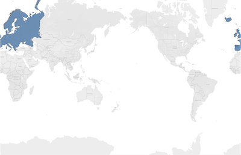
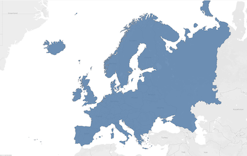

# adjust-vertex-order
## __adjust_vertex_order__


__Current Version__: 1.0

This sample demonstrates how you can adjust the vertex order of all polygons of an existing `.hyper` file. This is done by copying all of the tables and data into a new file while calling a SQL function (`geo_auto_vertex_order` or `geo_invert_vertex_order`) on all columns of type `GEOGRAPHY`.

For more information on Hyper's SQL functions that operate on `GEOGRAPHY` values, see [Geographic Functions](https://help.tableau.com/current/api/hyper_api/en-us/reference/sql/functions-geography.html).

## Background

For the `GEOGRAPHY` type, in case of polygons, the order of vertices in the polygon's rings defines what is inside and what is outside the polygon. 
Tableau's convention is "interior-left", which means that as we progress through the vertices of the polygon in storage order, the interior of the polygon is to the left.
In the "spheroidal" system, as used by Tableau, there is no such thing as "incorrect vertex ordering". Either ordering can be correct because in this system, reverse vertex ordering merely changes what space the polygon encloses.
Hence, there is no way to automatically detect the intention of what space a polygon is intended to enclose.
Depending on the data source used to import `GEOGRAPHY`, Tableau users may experience problems when their `.hyper` files contain `GEOGRAPHY` values with polygons whose vertices are in the reverse order of what is intended by the user.
For example, depending on how the polygons are specified, Tableau may not automatically zoom the map to the data. Another example is with spatial joins which would also produce unexpected results.

The image below depicts the problem with auto zoom for a collection of polygons, specified with an "interior-right" winding order, marking the boundaries of the European continent:



The image below depicts the desired case where the polygons are specified with an "interior-left" winding order:



## Script semantics

This sample script connects to two `.hyper` files, an input file and an output file, and copies all the schemas, tables and data from the input file into the (newly created) output file. During the copy, either `geo_auto_vertex_order` or `geo_invert_vertex_order` is called on all columns of type `GEOGRAPHY`. The copying of data from source to target tables is done entirely inside Hyper, i.e. no data (apart from table definitions) is exchanged between the Hyper and Python processes.
The script also provides a command to list all tables inside a `.hyper` file and enumerate any columns of type `GEOGRAPHY`.

## Running the sample script
This sample script accepts two commands `list` and `run`:
```
usage: adjust_vertex_order.py [-h] {list,run} ...

commands:
  {list,run}  Available commands
    list      Lists all tables in a .hyper file and shows columns of type
              GEOGRAPHY
    run       Copies tables from a .hyper file to a new file while adjusting
              vertex order of all polygons
```

The syntax for the `run` command is:
```
usage: adjust_vertex_order.py run [-h] -i <input.hyper> -o <output.hyper> -m
                                  {AdjustVertexOrderMode.AUTO,AdjustVertexOrderMode.INVERT}

optional arguments:
  -h, --help            show this help message and exit
  -i <input.hyper>, --input_file <input.hyper>
                        Input .hyper file
  -o <output.hyper>, --output_file <output.hyper>
                        Output .hyper file
  -m {AdjustVertexOrderMode.AUTO,AdjustVertexOrderMode.INVERT}, --mode {AdjustVertexOrderMode.AUTO,AdjustVertexOrderMode.INVERT}
                        Vertex order adjustment mode: (auto | invert). Auto:
                        assuming data comes from a source with a flat - earth
                        topology, it automatically adjusts the vertex order
                        according to the interior - left definition of
                        polygons. Invert: inverts the vertex order for all
                        polygons.
```

The syntax for the `list` command is:
```
usage: adjust_vertex_order.py list [-h] -i <input.hyper>

optional arguments:
  -h, --help            show this help message and exit
  -i <input.hyper>, --input_file <input.hyper>
                        Input .hyper file
```

Example:
```
$ python3 adjust_vertex_order.py run -i ./europe_interior_right.hyper -o ./europe_interior_left.hyper -m auto
Adjusting vertex order of polygons assuming data source with flat - earth topology in spatial columns
Copying table "input"."Extract"."Extract" with 1 spatial columns: [Name('Location')]...
   1 rows copied
```

## __Resources__
Check out these resources to learn more:

- [Hyper API docs](https://help.tableau.com/current/api/hyper_api/en-us/index.html)

- [Tableau Hyper API Reference (Python)](https://help.tableau.com/current/api/hyper_api/en-us/reference/py/index.html)

- [Hyper API SQL Reference](https://help.tableau.com/current/api/hyper_api/en-us/reference/sql/index.html)

- [Add Spatial Data to a Hyper File](https://help.tableau.com/current/api/hyper_api/en-us/docs/hyper_api_geodata.html)

- [Geographic Functions in Hyper's SQL API](https://help.tableau.com/current/api/hyper_api/en-us/reference/sql/functions-geography.html)
