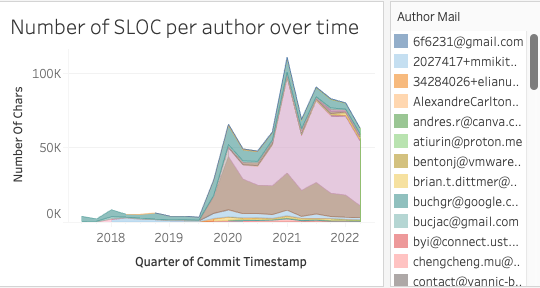

# git-to-hyper
## __git_to_hyper__


__Current Version__: 1.0

This sample shows you how use Hyper and Tableau to gain insights into a software project using the git meta data (e.g. commit timestamps). The  script extracts this data from a given git repository and stores is in a `git.hyper` file which can be used in Tableau.

Here are some examples for the [bazel-remote cache](https://github.com/buchgr/bazel-remote) OSS project:





## Prerequisites

To run the script, you will need:

- a computer running Windows, macOS, or Linux
- Python 3.9+
- install the dependencies from the `requirements.txt` file

## Run the basic sample

```bash
$ git clone https://github.com/tableau/hyper-api-samples.git
$ cd hyper-api-samples
$ pip3 install -r Community-Supported/git-to-hyper/requirements.txt
$ python Community-Supported/git-to-hyper/basic-git-to-hyper.py --path_to_repo ~/sample/repository
```

The basic sample is a very lightweight example of how to extract meta data from git and save it into a Hyper database. It extracts only very high-level information like timestamps of commits, their authors and metrics like number of added lines.

The script offers the following options:

```bash
$ python Community-Supported/git-to-hyper/basic-git-to-hyper.py --help
usage: basic-git-to-hyper.py [-h] [--branch BRANCH] path_to_repo

positional arguments:
  path_to_repo     Path to the repository, e.g. ~/src/repo

options:
  -h, --help       show this help message and exit
  --branch BRANCH  Branch to follow in the repository. Default: main
```

The script will generate a `git.hyper` file which can be used in Tableau for further analysis.

## Run the advanced sample

```bash
$ git clone https://github.com/tableau/hyper-api-samples.git
$ cd hyper-api-samples
$ pip3 install -r Community-Supported/git-to-hyper/requirements.txt
$ python Community-Supported/git-to-hyper/advanced-git-to-hyper.py --path_to_repo ~/sample/repository
```

The advanced sample gathers further data by e.g. running `git blame` for every changed file to count the source lines of code for every author. The results are stored in multiple tables inside the Hyper file and `FOREIGN_KEY` is used to link them together (see [here](https://github.com/tableau/hyper-api-samples/tree/main/Community-Supported/publish-multi-table-hyper) for a detailed explanation on how to use multiple tables in Hyper).

In order to speed things up multiple processes are used for data extraction and a single injection process for the communication to the Hyper database. Even if you are not interested in the git meta data, this sample can still be of interest to you if you are looking for ways to speed up your data extraction by using multiple processes.

The sample can optionally use a ram disk to speed up the extraction, as the duration of running `git blame` on every changed file is primarily limited by the I/O speed of your system. Moving the files into memory using a [ram disk](https://de.wikipedia.org/wiki/RAM-Disk) makes the execution time mostly independent from the I/O speed of your hard drive. Most Linux operating system provide a ram disk out-of-the box for you, mounted at `/dev/shm`. If the option `--ram_disk_dir` is not set no ram disk will used.

The script offers the following options:

```bash
$ python Community-Supported/git-to-hyper/advanced-git-to-hyper.py --help
usage: advanced-git-to-hyper.py [-h] [--branch BRANCH] [--ram_disk_dir RAM_DISK_DIR] [--number_of_workers NUMBER_OF_WORKERS]
                                [--file_size_limit FILE_SIZE_LIMIT] [--blame_only_for_head] [--verbose]
                                path_to_repo

positional arguments:
  path_to_repo          Path to the repository, e.g. ~/src/repo

options:
  -h, --help            show this help message and exit
  --branch BRANCH       Branch to follow in the repository. Default: main
  --ram_disk_dir RAM_DISK_DIR
                        Path to ram disk on the host machine. Used to improve the execution time by speeding up I/O heavy git operations. using "/dev/shm" should work for most Linux OS, if you are using a different OS you might need to create the ram disk manually first. It needs to have at least the size of the repository.
  --number_of_workers NUMBER_OF_WORKERS
                        How many parallel processes shall be used for the data extraction
  --file_size_limit FILE_SIZE_LIMIT
                        Files bigger than this limit are not analyzed. The unit is byte. Can be turned off by setting it to None. Default: 10 MB
  --blame_only_for_head
                        Run git blame only for the HEAD commit to speed up the data collection
  --verbose             Increase verbosity, e.g. print filenames of git blame targets
```

The script will generate a `git.hyper` file which can be used in Tableau for further analysis.

## __Resources__
Check out these resources to learn more:

- [Hyper API docs](https://tableau.github.io/hyper-db)

- [Tableau Hyper API Reference (Python)](https://tableau.github.io/hyper-db/lang_docs/py/index.html)
