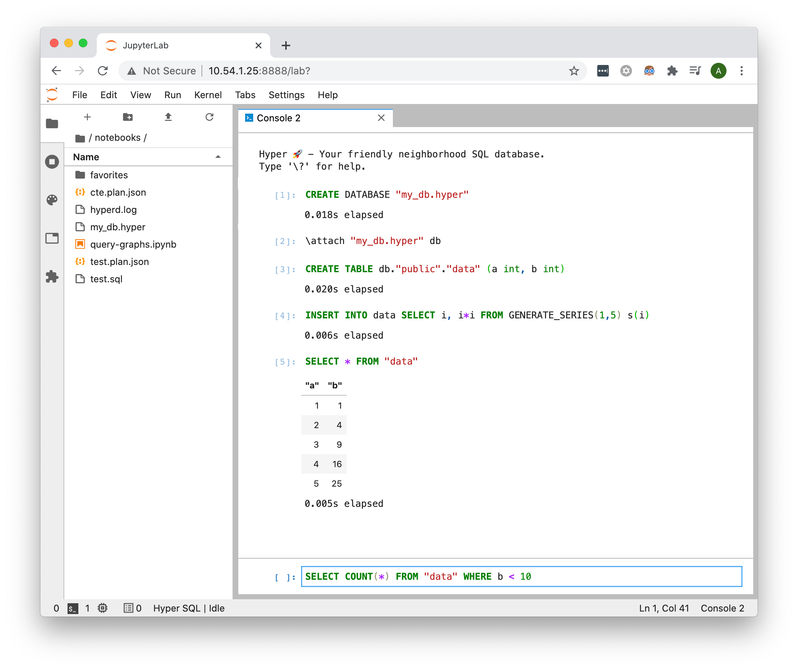

# hyper_kernel


The `hyper_kernel` provides you a console through which you can directly run SQL queries against Hyper.
You can use it to prototype your SQL queries, debug your Hyper files or simply explore HyperAPI's capabilities.

It integrates with the execution framework provided by the [Jupyter project](https://jupyter.org/).
Thereby, the `hyper_kernel` only has to take care of the actual execution of the SQL statements, but doesn't need to provide its own cross-platform text interface/UI, command-line history etc.

Being a Jupyter kernel, the `hyper_kernel` can be used in combination with the rest of the Jupyter ecosystem.
In particular:
* It can be run from an old-school or over a ssh-connection using `jupyter console --kernel=hyper`
* It can be used from JupyterLab's consoles, providing a more modern UI experience
* It can be used with JupyterLab notebooks, allowing to tell stories based on your SQL queries

## Get started using JupyterLab

JupyterLab is a web-based IDE for data-scientist.
With the `hyper_kernel` you can integrate HyperAPI's SQL interface directly into this IDE.



First, install JupyterLab and the kernel provided in this repository using

```
python3 -m pip install jupyterlab tableauhyperapi git+https://github.com/tableau/hyper-api-samples#subdirectory=Community-Supported/hyper-jupyter-kernel
python3 -m hyper_kernel.install
```

Next launch JupyterLab using

```
python3 -m jupyter lab --core-mode
```

and open JupyterLab in your browser


## Get started using the command-line interface


First, install jupyter-console and the kernel provided in this repository using

```
python3 -m pip install jupyter-console tableauhyperapi git+https://github.com/tableau/hyper-api-samples#subdirectory=Community-Supported/hyper-jupyter-kernel
python3 -m hyper_kernel.install
```

Afterwards, you can launch the console using

```
jupyter console --kernel=hyper
```

## Running your first query

Let's start with something simple: Enter

```
SELECT 12/2 AS result
```

into your console and submit it. You should get `6` as a result. Congrats! You just executed your first query.

# Quick start for common use cases

Independent of how you run your `hyper_kernel`, the usage is always similar:
You feed SQL to it, and in return you get the query results.
The [HyperAPI SQL reference](https://help.tableau.com/current/api/hyper_api/en-us/reference/sql/index.html) contains all the information you need.
For everyone who prefers to not read the whole reference first, here is a short quick start on the most common scenarios:


## Creating a Hyper database

That was boring, though... Instead of only using Hyper as your calculator, you usually want to use it to crunch some data.

First let's [create a new database](https://help.tableau.com/current/api/hyper_api/en-us/reference/sql/sql-createdatabase.html):
```
CREATE DATABASE "my_data.hyper";
```

and load that newly created database into our session:
```
\attach "patch/to/my/data.hyper" database1
```

Next, we will need to [create a table](https://help.tableau.com/current/api/hyper_api/en-us/reference/sql/sql-createtable.html):
```
CREATE TABLE database1.public.my_table (column1 text, column2 bigint);
```
where `database1` is the alias we gave to our database when running the `\attach` command

Maybe [insert some data](https://help.tableau.com/current/api/hyper_api/en-us/reference/sql/sql-insert.html):
```
INSERT INTO database1.public.my_table VALUES('one', 1),('two', 2),('three', 3)
```

And close the database:
```
\detach database1
```

and voila: You have your Hyper file which you could now use with Tableau.
In real-life you might want to put some more useful data in it, though.
You could do so, using e.g. the [COPY command](https://help.tableau.com/current/api/hyper_api/en-us/reference/sql/sql-copy.html) to load data from a CSV file.

## Examining an existing Hyper database

Let's assume you got a Hyper database and don't know what's in it.
Or maybe you just finished writing your HyperAPI script/program and want to double-check that it really writes the right data into your scripts...
Either way: The `hyper_kernel` allows you to quickly do so.

To open the Hyper file, use
```
\attach "data.hyper" database1
```

from here on, you can explore the data inside your file.

Particularly useful queries include:

to get an overview one exemplary row:
```
SELECT * FROM "Extract"."Extract" LIMIT 1
```

count the number of rows:
```
SELECT COUNT(*) FROM "Extract"."Extract"
```

# Built-in commands

Most of the time, you want to run [SQL commands](https://help.tableau.com/current/api/hyper_api/en-us/reference/sql/sql-commands.html).
In addition, this command line interface also offers a few convenience functions.
In particular, you can use:
* `\o <file>` to redirect the output of all following queries to a file
* `\o -` to disard the output of all following queries (mostly useful for measuring execution times if we don't care about the actual result)
* `\o` to reset the output and display it on the console again
* `\i <file>` to read a query from a file and execute it
* `\attach <filepath> <alias>` to open a Hyper file within your current session, such that you can access the tables contained within the Hyper file
* `\detach <alias>` to close a Hyper file which is currently attached
